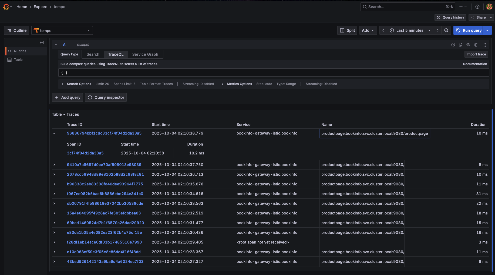
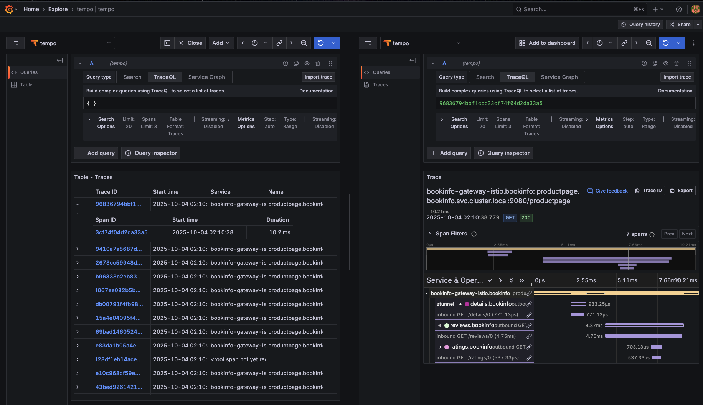

### Istio Ambient Mesh Multi-Cluster's Tracing using Gloo telemetry pipeline with Grafana Tempo

#### Deploy KinD clusters:
```bash
export MGMT=mgmt
export CLUSTER1=cluster1
export CLUSTER2=cluster2

bash ./data/deploy-mgmt.sh
bash ./data/deploy-cluster1.sh
bash ./data/deploy-cluster2.sh
```

#### Deploy and register Gloo Mesh
```bash
helm repo add gloo-platform https://storage.googleapis.com/gloo-platform/helm-charts
helm repo update
```

```bash
export GLOO_VERSION=2.10.0

helm upgrade -i gloo-platform-crds gloo-platform/gloo-platform-crds \
  --version=$GLOO_VERSION \
  --kube-context $MGMT \
  --create-namespace \
  --namespace=gloo-mesh

helm upgrade -i gloo-platform gloo-platform/gloo-platform \
  --version=$GLOO_VERSION \
  --namespace=gloo-mesh \
  --kube-context $MGMT \
  --set licensing.glooMeshLicenseKey=$GLOO_PLATFORM_LICENSE_KEY \
  --set licensing.glooTrialLicenseKey=$GLOO_PLATFORM_LICENSE_KEY \
  --set licensing.glooGatewayLicenseKey=$GLOO_PLATFORM_LICENSE_KEY \
  -f data/gloo-values-mc.yaml

# wait for the load balancer to be provisioned
until kubectl get service/gloo-mesh-mgmt-server --output=jsonpath='{.status.loadBalancer}' --context $MGMT -n gloo-mesh | grep "ingress"; do : ; done
until kubectl get service/gloo-telemetry-gateway --output=jsonpath='{.status.loadBalancer}' --context $MGMT -n gloo-mesh | grep "ingress"; do : ; done
GLOO_PLATFORM_SERVER_DOMAIN=$(kubectl get svc gloo-mesh-mgmt-server --context $MGMT -n gloo-mesh -o jsonpath='{.status.loadBalancer.ingress[0].ip}')
GLOO_PLATFORM_SERVER_ADDRESS=${GLOO_PLATFORM_SERVER_DOMAIN}:$(kubectl get svc gloo-mesh-mgmt-server --context $MGMT -n gloo-mesh -o jsonpath='{.spec.ports[?(@.name=="grpc")].port}')
GLOO_TELEMETRY_GATEWAY=$(kubectl get svc gloo-telemetry-gateway --context $MGMT -n gloo-mesh -o jsonpath='{.status.loadBalancer.ingress[0].ip}'):$(kubectl get svc gloo-telemetry-gateway --context $MGMT -n gloo-mesh -o jsonpath='{.spec.ports[?(@.port==4317)].port}')

echo "Mgmt Plane Address: $GLOO_PLATFORM_SERVER_ADDRESS"
echo "Metrics Gateway Address: $GLOO_TELEMETRY_GATEWAY"

kubectl get secret relay-root-tls-secret --context $MGMT -n gloo-mesh -o jsonpath='{.data.ca\.crt}' | base64 -d > ca.crt
kubectl get secret relay-identity-token-secret --context $MGMT -n gloo-mesh -o jsonpath='{.data.token}' | base64 -d > token
```

Install Gloo Agent on both clusters:
```bash
for CLUSTER in $CLUSTER1 $CLUSTER2; do
  echo "Installing Gloo Agent on $CLUSTER"
  
  kubectl create namespace gloo-mesh --context $CLUSTER

  kubectl create secret generic relay-root-tls-secret --from-file ca.crt=ca.crt --context $CLUSTER -n gloo-mesh
  kubectl create secret generic relay-identity-token-secret --from-file token=token --context $CLUSTER -n gloo-mesh

  helm upgrade -i gloo-platform-crds gloo-platform/gloo-platform-crds \
    --version=$GLOO_VERSION \
    --namespace=gloo-mesh \
    --kube-context $CLUSTER

  helm upgrade -i gloo-agent gloo-platform/gloo-platform \
    --version=$GLOO_VERSION \
    --namespace gloo-mesh \
    --kube-context $CLUSTER \
    -f data/gloo-agent-values.yaml \
    --set glooAgent.relay.serverAddress=$GLOO_PLATFORM_SERVER_ADDRESS \
    --set common.cluster=$CLUSTER \
    --set telemetryCollector.config.exporters.otlp.endpoint=$GLOO_TELEMETRY_GATEWAY
done
```

Verify install:
```bash
meshctl check
```


#### Install OSS Grafana and Prometheus
```bash
helm repo add prometheus-community https://prometheus-community.github.io/helm-charts
helm repo update prometheus-community
```
```bash
helm upgrade --install kube-prometheus-stack \
  prometheus-community/kube-prometheus-stack \
  --version 76.4.1 \
  --namespace monitoring \
  --create-namespace \
  --kube-context $MGMT \
  --values - <<EOF
alertmanager:
  enabled: false
grafana:
  service:
    type: LoadBalancer
    port: 3000
nodeExporter:
  enabled: false
prometheus:
  prometheusSpec:
    ruleSelectorNilUsesHelmValues: false
    serviceMonitorSelectorNilUsesHelmValues: false
    podMonitorSelectorNilUsesHelmValues: false
EOF
```

Install and configure OSS Tempo
```bash
helm repo add grafana https://grafana.github.io/helm-charts
helm repo update grafana
```
```bash
helm upgrade --install tempo \
grafana/tempo-distributed \
--namespace monitoring \
--create-namespace \
--wait \
--kube-context $MGMT \
--values - <<EOF
minio:
  enabled: false
distributor:
  service:
    type: LoadBalancer
traces:
  otlp:
    grpc:
      enabled: true
    http:
      enabled: true
  zipkin:
    enabled: false
  jaeger:
    thriftHttp:
      enabled: false
  opencensus:
    enabled: false
EOF
```
Add Tempo as a datasource in Grafana
```bash
GRAFANA_SVC_IP=$(kubectl --context $MGMT -n monitoring get svc kube-prometheus-stack-grafana -o jsonpath='{.status.loadBalancer.ingress[0].ip}')
open "http://${GRAFANA_SVC_IP}:3000/connections/datasources/new"
```
```sh
1. Login using admin/prom-operator
2. Add Tempo as datasource with http://tempo-query-frontend:3200
```
Then press `Save and test` to complete setup.  You should see a confirmation message like below:


#### Install and link new ambient meshes
```bash
export ISTIO_VERSION=1.26.0
export ISTIO_IMAGE=${ISTIO_VERSION}-solo

export REPO_KEY=d4cba2aff3ef
```

```bash
OS=$(uname | tr '[:upper:]' '[:lower:]' | sed -E 's/darwin/osx/')
ARCH=$(uname -m | sed -E 's/aarch/arm/; s/x86_64/amd64/; s/armv7l/armv7/')
echo $OS
echo $ARCH
```

```bash
mkdir -p ~/.istioctl/bin
curl -sSL https://storage.googleapis.com/istio-binaries-$REPO_KEY/$ISTIO_IMAGE/istioctl-$ISTIO_IMAGE-$OS-$ARCH.tar.gz | tar xzf - -C ~/.istioctl/bin
chmod +x ~/.istioctl/bin/istioctl

export PATH=${HOME}/.istioctl/bin:${PATH}
```

#### Create a shared root of trust (self-signed certs)
```bash
curl -L https://istio.io/downloadIstio | ISTIO_VERSION=${ISTIO_VERSION} sh -
cd istio-${ISTIO_VERSION}

mkdir -p certs
pushd certs
make -f ../tools/certs/Makefile.selfsigned.mk root-ca

function create_cacerts_secret() {
  context=${1:?context}
  cluster=${2:?cluster}
  make -f ../tools/certs/Makefile.selfsigned.mk ${cluster}-cacerts
  kubectl --context=${context} create ns istio-system || true
  kubectl --context=${context} create secret generic cacerts -n istio-system \
    --from-file=${cluster}/ca-cert.pem \
    --from-file=${cluster}/ca-key.pem \
    --from-file=${cluster}/root-cert.pem \
    --from-file=${cluster}/cert-chain.pem
}

export REMOTE_CLUSTER1=$CLUSTER1
export REMOTE_CLUSTER2=$CLUSTER2
export REMOTE_CONTEXT1=$CLUSTER1
export REMOTE_CONTEXT2=$CLUSTER2

create_cacerts_secret ${REMOTE_CONTEXT1} ${REMOTE_CLUSTER1}
create_cacerts_secret ${REMOTE_CONTEXT2} ${REMOTE_CLUSTER2}

cd ../..
```

#### Deploy Ambient components with tracing enabled
```bash
CLUSTERS=(
    ${REMOTE_CONTEXT1}:${REMOTE_CLUSTER1}
    ${REMOTE_CONTEXT2}:${REMOTE_CLUSTER2}
)

for cluster_info in "${CLUSTERS[@]}"; do
    # Split the cluster info into context and name
    IFS=':' read -r CLUSTER_CONTEXT CLUSTER_NAME <<< "$cluster_info"
    
    echo "=== Processing cluster: $CLUSTER_NAME (context: $CLUSTER_CONTEXT) ==="
    
    # Install Gloo Operator
    echo "Installing Gloo Operator on $CLUSTER_NAME..."
    helm install gloo-operator oci://us-docker.pkg.dev/solo-public/gloo-operator-helm/gloo-operator \
        --version 0.2.4 \
        -n gloo-mesh \
        --create-namespace \
        --kube-context ${CLUSTER_CONTEXT} \
        --set manager.env.SOLO_ISTIO_LICENSE_KEY=${GLOO_MESH_LICENSE_KEY}
    
    kubectl rollout status deployment/gloo-operator -n gloo-mesh --context ${CLUSTER_CONTEXT}
    
    # Create ServiceMeshController
    echo "Creating ServiceMeshController on $CLUSTER_NAME..."
    kubectl apply -n gloo-mesh --context ${CLUSTER_CONTEXT} -f -<<EOF
apiVersion: operator.gloo.solo.io/v1
kind: ServiceMeshController
metadata:
  name: managed-istio
  labels:
    app.kubernetes.io/name: managed-istio
spec:
  cluster: ${CLUSTER_NAME}
  network: ${CLUSTER_NAME}
  dataplaneMode: Ambient
  installNamespace: istio-system
  version: ${ISTIO_VERSION}
---
apiVersion: v1
kind: ConfigMap
metadata:
  name: gloo-extensions-config
  namespace: gloo-mesh
data:
  values.istiod: |
    pilot:
      env:
        PILOT_ENABLE_ALPHA_GATEWAY_API: "true"
    meshConfig:
      enableTracing: true
      defaultConfig:
        tracing:
          sampling: 100
          zipkin:
            address: gloo-telemetry-collector.gloo-mesh.svc.cluster.local:9411
  values.istio-ztunnel: |
    env:
      L7_ENABLED: true
    l7Telemetry:
      distributedTracing:
        otlpEndpoint: "http://gloo-telemetry-collector.gloo-mesh.svc.cluster.local:4317"
EOF

    # Verify ServiceMeshController is ready
    echo "Verifying ServiceMeshController on $CLUSTER_NAME..."
    kubectl describe servicemeshcontroller -n gloo-mesh managed-istio --context ${CLUSTER_CONTEXT}
    
    # Verify Istio components are running
    echo "Verifying Istio components on $CLUSTER_NAME..."
    kubectl get pods -n istio-system --context ${CLUSTER_CONTEXT}
    
    # Apply Gateway API CRDs
    echo "Applying Gateway API CRDs on $CLUSTER_NAME..."
    kubectl apply -f https://github.com/kubernetes-sigs/gateway-api/releases/download/v1.3.0/standard-install.yaml --context ${CLUSTER_CONTEXT}
    
    # Create east-west gateway
    echo "Creating east-west gateway on $CLUSTER_NAME..."
    kubectl create namespace istio-eastwest --context ${CLUSTER_CONTEXT} --dry-run=client -o yaml | kubectl apply -f - --context ${CLUSTER_CONTEXT}
    sleep 20
    echo "Creating east-west gateway..."
    istioctl multicluster expose --namespace istio-eastwest --context ${CLUSTER_CONTEXT}
    
    echo "=== Completed cluster: $CLUSTER_NAME ==="
    echo ""
done
```

Link the two workload clusters (Bi-directional)
```bash
istioctl multicluster link --namespace istio-eastwest --contexts=$REMOTE_CONTEXT1,$REMOTE_CONTEXT2
```

Verify in Gloo Mesh Dashboard:
```bash
meshctl dashboard
```

#### Upgrade the management cluster to enable tracing with Grafana Tempo:
```bash
helm get values gloo-platform -n gloo-mesh -o yaml --kube-context $MGMT > mgmt-plane-mc.yaml
```
```bash
cp mgmt-plane-mc.yaml mgmt-plane-mc-new.yaml

yq eval '.telemetryGatewayCustomization.extraExporters = {"otlp/tempo": {"endpoint": "tempo-distributor.monitoring.svc.cluster.local:4317", "tls": {"insecure": true}}}' -i mgmt-plane-mc-new.yaml

yq eval '.telemetryGatewayCustomization.extraPipelines = {"traces/tempo": {"exporters": ["otlp/tempo"], "processors": ["batch"], "receivers": ["otlp"]}}' -i mgmt-plane-mc-new.yaml

yq eval '.telemetryCollectorCustomization = {"pipelines": {"traces/istio": {"enabled": true}}}' -i mgmt-plane-mc-new.yaml
```

```bash
helm upgrade gloo-platform gloo-platform/gloo-platform \
--kube-context $MGMT \
--namespace gloo-mesh \
-f mgmt-plane-mc-new.yaml \
--version=$GLOO_VERSION

kubectl --context $MGMT rollout status deployment/gloo-mesh-mgmt-server -n gloo-mesh
```
Perform restart:
```bash
kubectl rollout restart -n gloo-mesh deployment/gloo-telemetry-gateway --context $MGMT
kubectl rollout restart -n gloo-mesh daemonset/gloo-telemetry-collector-agent --context $MGMT
```

Upgrade the workload cluster `cluster1` to enable tracing:
```bash
helm get values gloo-agent -n gloo-mesh -o yaml --kube-context $REMOTE_CONTEXT1 > data-plane-mc-1.yaml
```
```bash
cp data-plane-mc-1.yaml data-plane-mc-1-new.yaml

yq eval '.telemetryCollectorCustomization = {"skipVerify": true, "pipelines": {"traces/istio": {"enabled": true}}}' -i data-plane-mc-1-new.yaml
```
```bash
helm upgrade gloo-agent gloo-platform/gloo-platform \
--kube-context $REMOTE_CONTEXT1 \
--namespace gloo-mesh \
-f data-plane-mc-1-new.yaml \
--version=$GLOO_VERSION
```
Verify:
```bash
kubectl get configmap gloo-telemetry-collector-config -n gloo-mesh -o yaml --context $REMOTE_CONTEXT1
```
Perform restart:
```bash
kubectl rollout restart -n gloo-mesh daemonset/gloo-telemetry-collector-agent --context $REMOTE_CONTEXT1
```
Upgrade the workload cluster `cluster2` to enable tracing:
```bash
helm get values gloo-agent -n gloo-mesh -o yaml --kube-context $REMOTE_CONTEXT2 > data-plane-mc-2.yaml
```
```bash
cp data-plane-mc-2.yaml data-plane-mc-2-new.yaml

yq eval '.telemetryCollectorCustomization = {"skipVerify": true, "pipelines": {"traces/istio": {"enabled": true}}}' -i data-plane-mc-2-new.yaml
```
```bash
helm upgrade gloo-agent gloo-platform/gloo-platform \
--kube-context $REMOTE_CONTEXT2 \
--namespace gloo-mesh \
-f data-plane-mc-2-new.yaml \
--version=$GLOO_VERSION
```
Verify:
```bash
kubectl get configmap gloo-telemetry-collector-config -n gloo-mesh -o yaml --context $REMOTE_CONTEXT2
```
Perform restart:
```bash
kubectl rollout restart -n gloo-mesh daemonset/gloo-telemetry-collector-agent --context $REMOTE_CONTEXT2
```


#### Deploy Bookinfo sample app
```bash
kubectl --context $CLUSTER1 create ns bookinfo
```
```bash
kubectl --context $CLUSTER1 apply -n bookinfo -f https://raw.githubusercontent.com/istio/istio/refs/heads/master/samples/bookinfo/platform/kube/bookinfo.yaml
```
Add `bookinfo` namespace to Istio Ambient mesh:
```bash
kubectl --context $CLUSTER1 label ns bookinfo istio.io/dataplane-mode=ambient
```

#### Provision ingress gateway:
```bash
kubectl --context $CLUSTER1 apply -n bookinfo -f https://raw.githubusercontent.com/istio/istio/refs/heads/master/samples/bookinfo/gateway-api/bookinfo-gateway.yaml
```

#### Generate traffic:
```bash
export GW_IP=$(kubectl --context $CLUSTER1 get gtw -n bookinfo bookinfo-gateway -ojsonpath='{.status.addresses[0].value}')
echo $GW_IP
```
```bash
while true; do curl --head http://$GW_IP/productpage; sleep 1; done
```

#### View traces in Grafana Tempo
```bash
GRAFANA_SVC_IP=$(kubectl --context $MGMT -n monitoring get svc kube-prometheus-stack-grafana -o jsonpath='{.status.loadBalancer.ingress[0].ip}')
open "http://${GRAFANA_SVC_IP}:3000/"
```

Login using `admin/prom-operator` and click `Explore` menu item from the `Grafana` menu bar.       
Choose tempo from the dropdown list and enter `{}` in the **TraceQL** box.    
Then hit the blue **Run** button to view traces.





